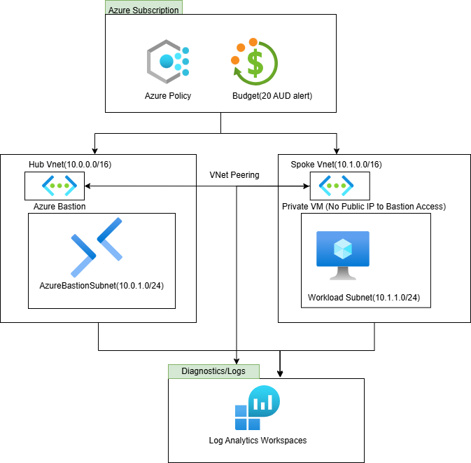
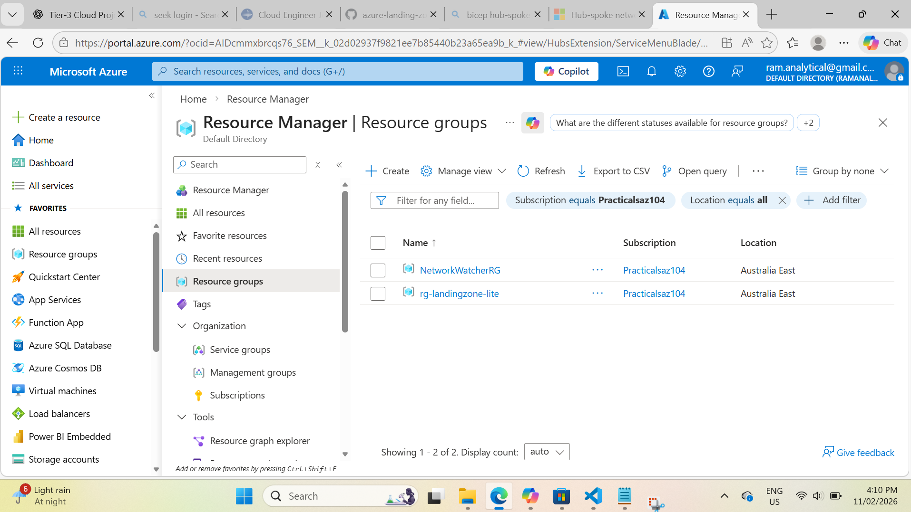
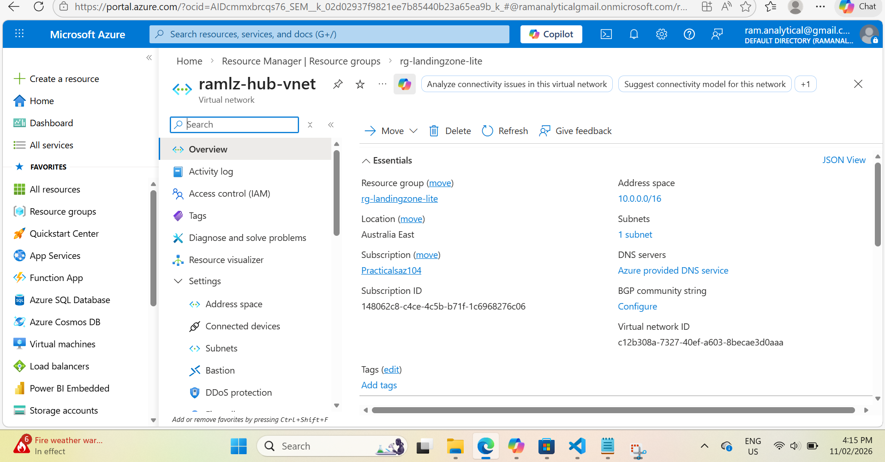
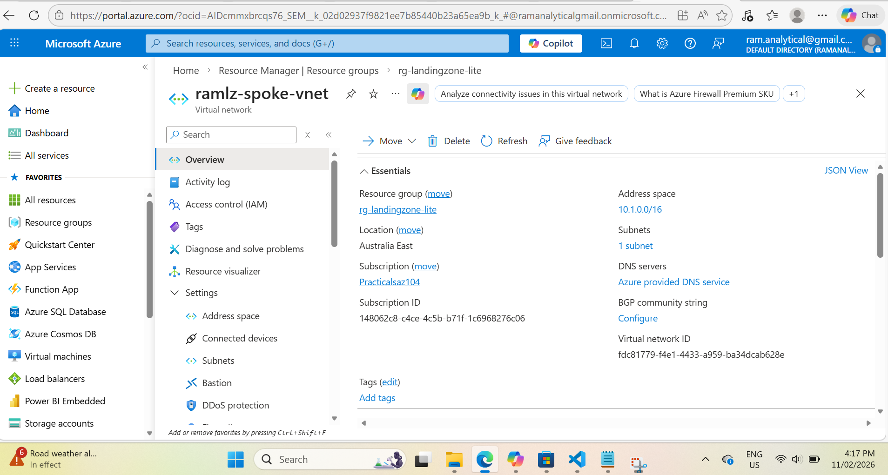
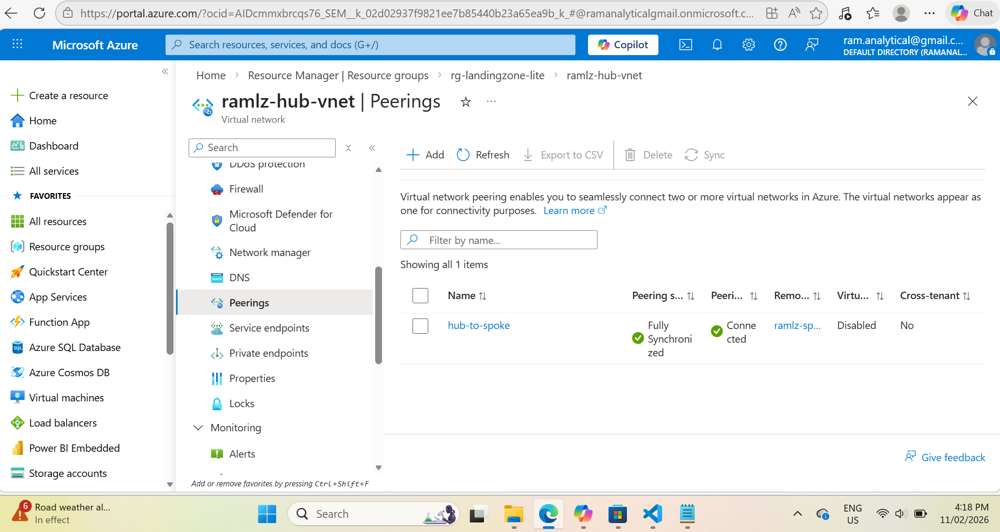
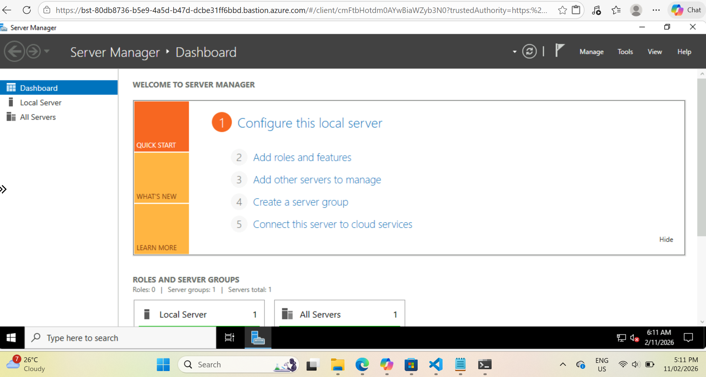
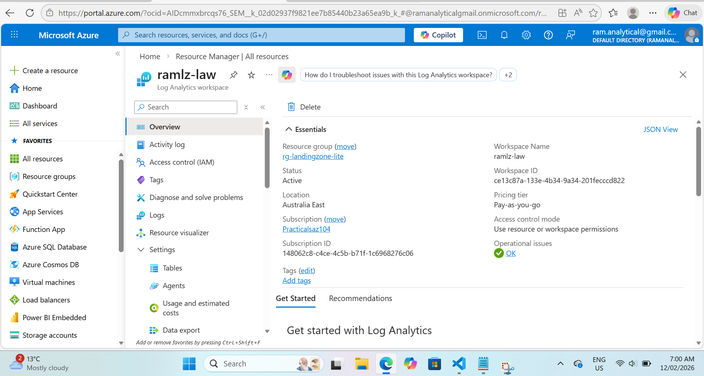

# Azure Platform Foundation with Bicep

A modular Azure infrastructure foundation built with **Bicep**, demonstrating hub-spoke networking, secure virtual machine access, Azure Policy governance, and a central monitoring workspace.

This portfolio-scale project applies selected Azure landing-zone principles through repeatable Infrastructure as Code.

## Architecture



```text
Internet
   │
   ▼
Azure Bastion Public IP
   │
   ▼
Azure Bastion
Hub Virtual Network
   │
   │ VNet Peering
   ▼
Spoke Virtual Network
   │
   ▼
Workload Subnet
   │
   ▼
Windows Server VM
No Public IP
```

Supporting platform services:

```text
Azure Policy      → Restricts resource deployment to Australia East
Log Analytics     → Provides the central monitoring workspace
```

## Design Principles

The solution applies Azure architecture principles through:

* **Infrastructure as Code:** Modular Bicep provides consistent and repeatable deployments.
* **Network segmentation:** Hub and spoke virtual networks separate shared connectivity from workloads.
* **Secure administration:** Azure Bastion provides VM access without assigning a public IP to the VM.
* **Governance:** Azure Policy restricts resource deployment to the approved Azure region.
* **Monitoring foundation:** Log Analytics provides a central workspace for future diagnostic collection.
* **Cost awareness:** A small VM SKU is used, and lab resources can be removed after validation.

The project is informed by Azure Landing Zone, Cloud Adoption Framework, and Well-Architected Framework principles. It is not intended to represent a complete enterprise landing-zone implementation.

## Technology Stack

| Area                   | Technology                       |
| ---------------------- | -------------------------------- |
| Cloud platform         | Microsoft Azure                  |
| Infrastructure as Code | Bicep                            |
| Networking             | Hub-spoke VNets and VNet peering |
| Secure access          | Azure Bastion                    |
| Compute                | Windows Server virtual machine   |
| Governance             | Azure Policy                     |
| Monitoring foundation  | Log Analytics Workspace          |
| Deployment             | Azure CLI                        |

## Deployed Resources

The Bicep deployment provisions:

* Hub virtual network
* Azure Bastion subnet
* Spoke virtual network
* Workload subnet
* Bidirectional VNet peering
* Azure Bastion and Standard public IP
* Windows Server virtual machine
* Network interface with private IP only
* Log Analytics workspace
* Allowed Locations policy assignment

## Repository Structure

```text
.
├── infra/
│   ├── main.bicep
│   └── modules/
│       ├── networking.bicep
│       ├── bastion.bicep
│       ├── vm.bicep
│       ├── monitoring.bicep
│       ├── policy.bicep
│       └── budget.bicep
├── docs/
│   ├── Architecture_Diagram/
│   │   └── alz_architecture.drawio.png
│   └── Screenshots/
├── scripts/
└── README.md
```

> The budget module is currently a placeholder and is not deployed by `main.bicep`.

## Deployment

Create the resource group:

```bash
az group create \
  --name rg-landingzone-lite \
  --location australiaeast
```

Deploy the Bicep template:

```bash
az deployment group create \
  --resource-group rg-landingzone-lite \
  --template-file infra/main.bicep \
  --parameters adminPassword="<secure-password>"
```

The administrator password is defined as a secure Bicep parameter and should not be stored in the repository.

## Validation

Validate the deployed resources:

```bash
az resource list \
  --resource-group rg-landingzone-lite \
  --output table
```

Validate the virtual network peerings:

```bash
az network vnet peering list \
  --resource-group rg-landingzone-lite \
  --vnet-name ramlz-hub-vnet \
  --output table
```

Confirm that the VM has no public IP:

```bash
az vm show \
  --resource-group rg-landingzone-lite \
  --name ramlz-vm \
  --show-details \
  --query "{PrivateIPs:privateIps, PublicIPs:publicIps}" \
  --output table
```

## Project Evidence

### Deployed Resources



### Hub-Spoke Networking





### VNet Peering



### Secure VM Access

.png)



### Monitoring Foundation



## Key Outcomes

* Built a reusable Azure infrastructure foundation using modular Bicep.
* Implemented hub-spoke networking with bidirectional VNet peering.
* Removed direct public access from the workload virtual machine.
* Enabled secure administrative access through Azure Bastion.
* Applied an Azure Policy guardrail for approved resource locations.
* Provisioned a Log Analytics workspace as the monitoring foundation.
* Demonstrated repeatable deployment and resource cleanup using Azure CLI.

## Cleanup

Delete the lab resources after validation to avoid unnecessary Azure charges:

```bash
az group delete \
  --name rg-landingzone-lite \
  --yes \
  --no-wait
```

## Roadmap

* Implement subscription-level budget and cost notifications
* Configure diagnostic settings for supported Azure resources
* Add Azure Monitor alert rules and action groups
* Replace password authentication with SSH keys or Microsoft Entra ID
* Add network security groups and controlled traffic rules
* Introduce Azure Firewall or a network virtual appliance
* Add private DNS and private endpoint patterns
* Separate platform and workload deployments
* Add CI/CD validation and controlled Bicep deployment
* Expand governance with Azure Policy initiatives
